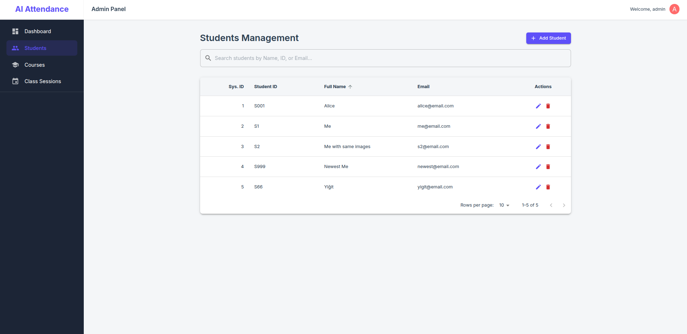
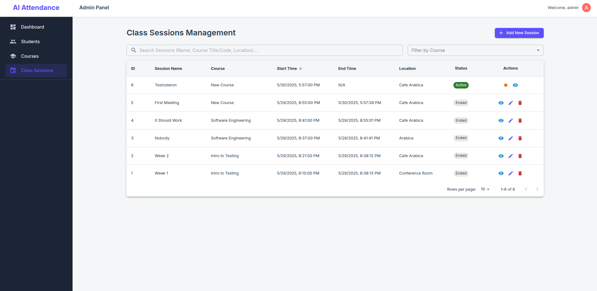
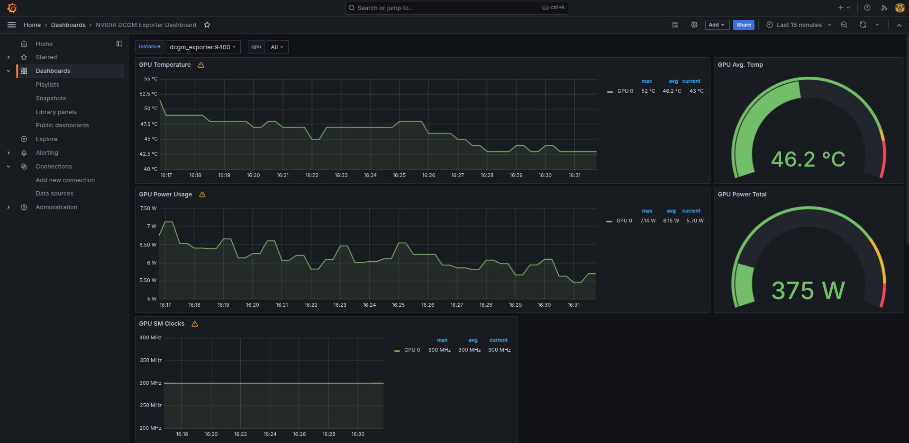
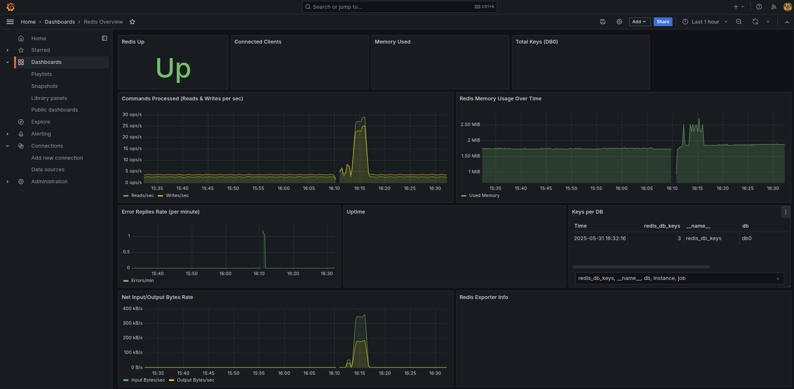

# AI-Powered Automated Attendance System (AttendAI)

AttendAI is a robust, scalable, and efficient automated attendance system using facial recognition. Designed for educational institutions or organizational settings, it provides administrators with comprehensive tools to manage courses, students, and class sessions, and to monitor attendance with real-time feedback and in-depth system observability.

The system features a Python FastAPI backend leveraging asynchronous operations, GPU-accelerated machine learning via Celery for tasks like face detection, embedding generation (with data augmentation), and a dynamic FAISS indexing strategy for fast, course-specific recognition. Real-time feedback is provided through WebSockets. A comprehensive monitoring stack using Prometheus, Grafana, and Flower offers insights into system health and performance. The entire application is containerized using Docker and Docker Compose.

## Core Features

- **Admin-Only Control:** Secure access via JWT-based authentication for all management functionalities.
- **Frontend Admin Panel:** A React-based single-page application (SPA) for administrators to manage students, courses, enrollments, class sessions, and view attendance results.
- **Course & Enrollment Management:** Admins can create courses, enroll/unenroll students in courses, and manage class sessions.
- **Student Biometric Enrollment with Data Augmentation:**
  - Admins securely enroll students by uploading multiple facial images.
  - Celery background tasks process these images, performing face detection.
  - **Data Augmentation:** For each good quality detected face crop, multiple augmented versions are generated (e.g., flips, brightness/contrast changes, slight rotations) to create more robust and diverse facial embeddings.
  - All original and augmented embeddings are stored, linked to the student.
- **GPU-Accelerated Face Recognition (via Celery Workers):**
  - **Detection:** Utilizes DeepFace with configurable backends (e.g., MTCNN, RetinaFace) running on NVIDIA GPUs.
  - **Encoding:** Employs pre-trained models like Facenet (via DeepFace) on GPUs to generate facial embeddings.
- **Dynamic & Efficient FAISS Indexing:**
  - **Global Index:** A master FAISS index of all student embeddings is maintained and periodically rebuilt by a Celery Beat task, with incremental updates attempted by enrollment tasks.
  - **Course-Specific In-Memory Indexes:** For active attendance sessions, Celery workers dynamically build and cache small, in-memory FAISS indexes containing only the embeddings of students enrolled in the specific course of that session. This ensures fast and relevant matching.
  - **Redis-based Versioning:** Course enrollment changes trigger version updates in Redis, signaling workers to refresh their course-specific FAISS caches.
- **Real-time Attendance Processing:**
  - Frames submitted to an active class session are processed by Celery workers.
  - Recognized faces are matched against the relevant course-specific FAISS index.
  - Attendance is logged asynchronously to a PostgreSQL database.
- **WebSocket Real-time Feedback:** Provides instant feedback to connected clients (e.g., a camera client) showing recognized students (enrolled or not in the current session) and unknown faces.
- **Comprehensive Monitoring & Observability (Prometheus, Grafana, Flower):**
  - **Celery Flower:** Web UI for real-time monitoring of Celery tasks, workers, and queues (using Flower's own basic auth, proxied via Nginx).
  - **Prometheus:** Collects metrics from:
    - FastAPI application (request rates, latencies, errors via `starlette-prometheus`).
    - Nginx (via `nginx-prometheus-exporter`).
    - Host system (via `node_exporter`).
    - PostgreSQL database (via `postgres-exporter`).
    - Redis (via `redis_exporter`).
    - NVIDIA GPUs (via `dcgm-exporter`).
    - Flower's own `/metrics` endpoint.
  - **Grafana:** Provides dashboards for visualizing all collected metrics, offering insights into system health, performance, and resource utilization. Access to Grafana is proxied via Nginx.
- **Distributed & Scalable Architecture:**
  - **FastAPI Backend:** Asynchronous API, WebSocket handling, task dispatching (proxied by Nginx).
  - **Celery Workers:** Distributed, GPU-accelerated ML task execution.
  - **Celery Beat:** Scheduled background tasks (e.g., global FAISS index rebuild).
  - **Redis:** Message broker, Pub/Sub for WebSockets, caching for active session state and course enrollment versions.
  - **PostgreSQL:** Robust relational database with SQLAlchemy ORM and Alembic for migrations.
  - **Nginx:** Reverse proxy, load balancing (future), SSL termination (future), basic security, serving static files (if admin panel is co-deployed).
- **Containerized:** Fully defined with Docker and Docker Compose for reproducible environments and simplified deployment.
- **Configurable ML Pipeline:** Settings for face detector backend, detection confidence, encoding model, augmentation count, and image pre-processing are managed via environment variables.
- **Liveness Detection:** Includes a placeholder for future integration of a robust liveness detection model.

## Technology Stack

- **Backend:** Python 3.10+, FastAPI, Uvicorn, SQLAlchemy, Alembic, AsyncPG
- **Frontend Admin Panel:** React, TypeScript, Vite, Material UI (MUI), React Router, Axios
- **Machine Learning:** TensorFlow, DeepFace (MTCNN, Facenet, etc.), FAISS (CPU), OpenCV, Pillow, Albumentations
- **Task Queue & Messaging:** Celery, Redis
- **Monitoring:** Prometheus, Grafana, Flower, `starlette-prometheus`, `postgres-exporter`, `redis_exporter`, `nginx-prometheus-exporter`, `dcgm-exporter` (for GPU)
- **Real-time Communication:** WebSockets
- **Web Server/Reverse Proxy:** Nginx
- **Database:** PostgreSQL
- **Containerization:** Docker, Docker Compose
- **Dependency Management:** Poetry (backend), NPM (frontend)
- **Authentication:** OAuth2 Password Bearer flow with JWTs for admin panel.
- **Core Libraries:** NumPy, Pydantic, Pydantic-Settings.

## Admin Panel & System Screenshots

_(Consider re-adding your table of screenshots here, or linking to a separate page/directory if it becomes too long for the main README. For now, I'll assume the previous table is still representative.)_

<table>
  <tr>
    <td></td>
    <td></td>
  </tr>
  <tr>
    <td align="center"><em>Camera Client Example</em></td>
    <td align="center"><em>Camera Client (Multiple Faces)</em></td>
  </tr>
  <tr>
    <td></td>
    <td></td>
  </tr>
  <tr>
    <td align="center"><em>Admin Login</em></td>
    <td align="center"><em>Admin Dashboard</em></td>
  </tr>
  <tr>
    <td></td>
    <td></td>
  </tr>
  <tr>
    <td align="center"><em>Students Page</em></td>
    <td align="center"><em>Courses Page</em></td>
  </tr>
  <tr>
    <td></td>
    <td></td>
  </tr>
  <tr>
    <td align="center"><em>Sessions Page</em></td>
    <td align="center"><em>Session Result (Attendance) Page</em></td>
  </tr>
  <tr>
    <td></td> <!-- Replace with your actual screenshot -->
    <td></td> <!-- Replace with your actual screenshot -->
  </tr>
  <tr>
    <td align="center"><em>Celery Flower Monitoring</em></td>
    <td align="center"><em>Grafana - Node Metrics</em></td>
  </tr>
   <tr>
    <td></td> <!-- Add this screenshot -->
    <td></td> <!-- Add this screenshot -->
  </tr>
  <tr>
    <td align="center"><em>Grafana - GPU Monitoring</em></td>
    <td align="center"><em>Grafana - Redis Monitoring</em></td>
  </tr>
</table>
(There are more screenshots inside docs/screenshots folder)

## Setup and Installation

### Prerequisites

- Docker Engine (latest stable version recommended)
- Docker Compose (V2 syntax: `docker compose`)
- **For GPU Acceleration:**
  - NVIDIA GPU with appropriate drivers installed on the Docker host.
  - NVIDIA Container Toolkit installed and configured on the Docker host.
- Node.js and npm (or yarn) - _Only if you intend to build the frontend separately or run its development server._ The provided Docker setup can serve a pre-built frontend.
- `htpasswd` utility (from `apache2-utils` or `httpd-tools`) - _Only if you re-enable Nginx basic auth for Grafana (currently disabled)._

### Configuration

1.  **Clone the Repository:**

    ```bash
    git clone <your_repository_url>
    cd ai-attendance-system
    ```

2.  **Environment Variables (`.env`):**
    Create a `.env` file in the project root by copying `.env.example` (if you provide one) or by creating it from scratch. Key variables:

    ```env
    # --- FastAPI App ---
    APP_BASE_DIR=/app # Default inside Docker, usually not needed in .env

    # --- JWT Authentication ---
    SECRET_KEY=YOUR_VERY_STRONG_RANDOM_SECRET_KEY # IMPORTANT: Generate using: openssl rand -hex 32
    ALGORITHM=HS256
    ACCESS_TOKEN_EXPIRE_MINUTES=60

    # --- Database Configuration ---
    POSTGRES_USER=your_db_user
    POSTGRES_PASSWORD=your_db_password
    POSTGRES_DB=attendance_db
    DATABASE_URL=postgresql+asyncpg://${POSTGRES_USER}:${POSTGRES_PASSWORD}@db:5432/${POSTGRES_DB}

    # --- Celery Configuration ---
    CELERY_BROKER_URL=redis://redis:6379/0
    # CELERY_RESULT_BACKEND=redis://redis:6379/1 # Optional result backend

    # --- General Redis Configuration ---
    REDIS_URL=redis://redis:6379/2 # For Pub/Sub, AttendanceManager cache, Course Versions
    REDIS_PUBSUB_RESULTS_CHANNEL=attendance_results_channel

    # --- ML Models & Parameters ---
    FACE_DETECTOR_BACKEND="mtcnn" # e.g., mtcnn, retinaface, yunet
    FACE_DETECTION_CONFIDENCE_THRESHOLD=0.90
    FACE_ENCODING_MODEL="Facenet" # FAISS_INDEX_DIMENSION derived from this
    FACE_SIMILARITY_THRESHOLD=0.65 # Adjust as needed
    ENROLLMENT_AUGMENTATIONS_PER_IMAGE=4
    # LIVENESS_MODEL_PATH= # Optional path to a liveness model

    # --- Image Pre-processing ---
    PREPROCESS_RESIZE_MAX_DIM=1024
    PREPROCESS_APPLY_CLAHE=true

    # --- Celery Flower ---
    FLOWER_USER=your_flower_admin_username
    FLOWER_PASSWORD=a_strong_flower_password

    # --- Grafana Internal Admin ---
    GRAFANA_ADMIN_USER=admin # Or your preferred Grafana admin
    GRAFANA_ADMIN_PASSWORD=your_strong_grafana_admin_password
    GF_SERVER_ROOT_URL=http://localhost/grafana # Or your external domain/IP if accessing Nginx differently

    # --- Nginx Basic Auth for Grafana (Currently Disabled in Nginx Conf) ---
    # If you re-enable Nginx auth for Grafana, set these and create .htpasswd-grafana
    # GRAFANA_NGINX_USER=your_grafana_nginx_user
    # GRAFANA_NGINX_PASSWORD=your_grafana_nginx_password
    ```

3.  **ML Model Weights (if not downloaded automatically by DeepFace):**
    If DeepFace doesn't automatically download the models (like `facenet_weights.h5`), place them in the `data/ml_weights/` directory. The Dockerfile attempts to copy `facenet_weights.h5`.

4.  **(If Nginx Basic Auth for Grafana is Re-enabled) Create `.htpasswd-grafana`:**
    If you decide to use Nginx basic auth for Grafana again:
    ```bash
    # In the ./nginx directory or project root as per your docker-compose volume mount
    htpasswd -c .htpasswd-grafana your_grafana_nginx_user
    ```

### Running the Application

1.  **Build Docker Images:**

    ```bash
    docker compose build
    ```

2.  **Initialize Database & Run Migrations (First time setup):**

    - Start the database service: `docker compose up -d db`
    - Wait a few seconds for PostgreSQL to initialize.
    - Run Alembic migrations:
      ```bash
      docker compose exec app poetry run alembic upgrade head
      ```

3.  **Create Initial Admin User for the Application:**
    Run the script inside the `app` container:

    ```bash
    docker compose exec app poetry run python scripts/create_admin.py
    ```

    Follow the prompts to set the admin username and password for AttendAI.

4.  **Start All Services:**
    ```bash
    docker compose up -d
    ```
    To view logs for all services: `docker compose logs -f`
    To view logs for a specific service: `docker compose logs -f <service_name>` (e.g., `app`, `celery_worker`, `nginx`, `prometheus`, `grafana`).

### Accessing Services

- **AttendAI Admin Panel:** Navigate to `http://localhost` (or your server's IP/domain if deployed elsewhere). This should serve the React frontend, which will likely redirect to `/login`.
- **FastAPI Docs (Swagger UI):** `http://localhost/docs` (Access protected endpoints by authorizing with a token obtained from `/auth/admin/token`).
- **Celery Flower:** `http://localhost/flower/`
  - Login with `FLOWER_USER` and `FLOWER_PASSWORD` from your `.env` file.
- **Grafana:** `http://localhost/grafana/`
  - Log in with `GRAFANA_ADMIN_USER` and `GRAFANA_ADMIN_PASSWORD` from your `.env` file (you'll be prompted to change the password on first login if using defaults).
- **Prometheus UI (Optional, if port exposed):** `http://localhost:9090` (The `docker-compose.yml` has this port exposed for Prometheus currently).

### Example Camera Client

1.  Ensure the backend is running and you have an _active_ class session (started via the admin panel).
2.  On a machine with a camera and Python environment (`opencv-python`, `requests`, `websockets` installed):
`bash
    python scripts/camera_client.py --session <ACTIVE_SESSION_ID_FROM_ADMIN_PANEL> --url http://localhost
    `
<h2>Project Structure (Key Directories)</h2>
<p>A high-level overview of the project's directory layout:</p>
<pre><code>
.
├── config/                     <em># Configuration files (settings.py, logging_config.yaml)</em>
├── data/                       <em># Persistent data (logs, FAISS indexes, ML weights)</em>
│   ├── faiss_indexes/          <em># Saved FAISS index files & maps</em>
│   ├── logs/                   <em># Application, Celery, and potentially other service logs</em>
│   └── ml_weights/             <em># Pre-trained machine learning model weights</em>
├── docs/                       <em># Documentation and supporting materials</em>
│   └── screenshots/            <em># Screenshots for README and documentation</em>
├── frontend-admin/             <em># React Admin Panel source code (Vite, TypeScript, MUI)</em>
├── nginx/                      <em># Nginx specific configurations and Dockerfile</em>
│   ├── conf.d/default.conf     <em># Main Nginx server block configuration</em>
│   ├── .htpasswd-grafana       <em># (If Nginx basic auth for Grafana is re-enabled)</em>
│   └── Dockerfile              <em># Dockerfile for building the Nginx image</em>
├── prometheus/                 <em># Prometheus specific configurations</em>
│   └── prometheus.yml          <em># Prometheus scrape targets and global configuration</em>
├── scripts/                    <em># Utility and helper scripts</em>
│   ├── camera_client.py        <em># Example client to send frames from a camera</em>
│   ├── create_admin.py         <em># Script to create an initial admin user</em>
│   └── rebuild_faiss.py        <em># Script logic for rebuilding the global FAISS index (used by Celery Beat)</em>
├── src/                        <em># Backend Python source code (FastAPI application)</em>
│   ├── api/                    <em># FastAPI application, routers, Pydantic schemas, dependencies</em>
│   │   ├── routers/
│   │   ├── schemas/
│   │   └── dependencies.py
│   ├── core/                   <em># Core business logic, Celery app, managers, tasks</em>
│   │   ├── tasks/              <em># Celery tasks (attendance, enrollment, maintenance)</em>
│   │   ├── attendance_manager.py
│   │   ├── celery_app.py
│   │   └── websocket_manager.py
│   ├── database/               <em># Database interaction layer</em>
│   │   ├── migrations/         <em># Alembic database schema migrations</em>
│   │   ├── crud.py
│   │   ├── database.py
│   │   └── models.py
│   └── ml/                     <em># Machine learning components</em>
│       ├── augmentations.py
│       ├── face_detector.py
│       ├── face_encoder.py
│       ├── face_matcher.py
│       ├── liveness_detector.py
│       └── preprocess.py
├── .env                        <em># Environment variables (GIT IGNORED!)</em>
├── .gitignore
├── alembic.ini                 <em># Alembic configuration file</em>
├── docker-compose.yml          <em># Docker Compose definition for all services</em>
├── Dockerfile                  <em># Main Dockerfile for FastAPI app & Celery workers</em>
├── poetry.lock                 <em># Poetry lock file for Python dependencies</em>
├── pyproject.toml              <em># Poetry project configuration and dependencies</em>
└── README.md                   <em># Project README file (this one)</em>
</code></pre>

## Future Development & Roadmap Considerations

While this marks a significant milestone, further enhancements could include:

- **A.3 Foundational Automated Testing & CI/CD:** Crucial for stability and future development.
- **C.1 Web Application Firewall (WAF):** Investigate Nginx + ModSecurity for enhanced security in production.
- **C.2 Database Read Replicas:** If read load becomes a bottleneck.
- **C.3 Advanced Authentication & Authorization:** More granular RBAC if needed.
- **C.5 ML Model Optimization (TensorRT):** For further inference speed improvements if GPU tasks are bottlenecks.
- **Enhanced Liveness Detection:** Replace the placeholder with a robust liveness detection model.
- **Frontend Enhancements:** Live session monitoring, more detailed reports.
- **Scalability:** Further scaling of Celery workers, advanced message queue configurations.
- **Deployment Strategies:** Kubernetes, cloud-specific deployments.
