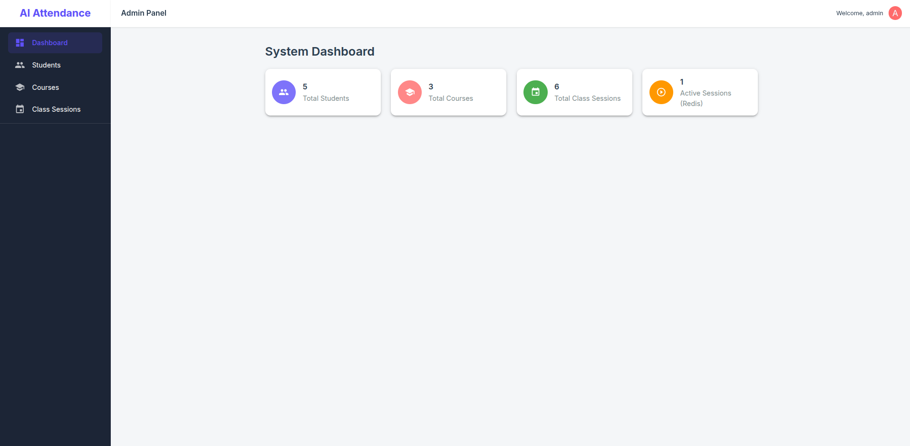
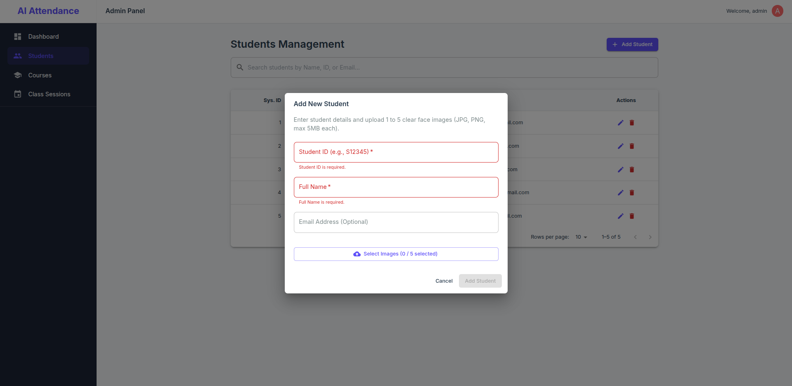
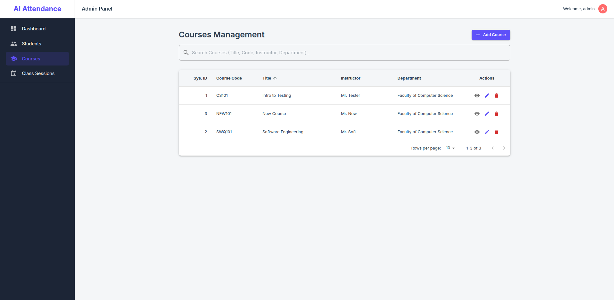
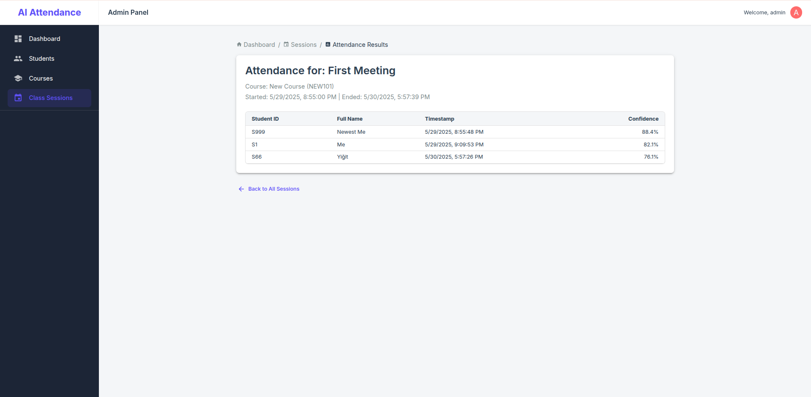

# AI-Powered Automated Attendance System

This project implements a robust, scalable, and efficient automated attendance system using facial recognition. It's designed for educational institutions or organizational settings where an administrator manages courses, students, sessions, and monitors attendance. The system features a Python FastAPI backend, asynchronous operations, GPU-accelerated machine learning via Celery, real-time feedback through WebSockets, and a React-based frontend admin panel.

## Core Features

- **Admin-Only Control:** Secure access to all management functionalities via an admin login.
- **Frontend Admin Panel:** A React-based single-page application for administrators to manage the entire system.
- **Course and Enrollment Management:** Admins can create courses, enroll students in courses, and manage class sessions specific to each course.
- **Student Biometric Enrollment:** Admins can securely enroll students by processing multiple facial images, which are then used to generate robust embeddings by background Celery tasks.
- **GPU-Accelerated Face Recognition:**
  - **Detection:** Utilizes DeepFace with configurable backends (e.g., MTCNN, RetinaFace, YuNet) running on NVIDIA GPUs via Celery workers for high performance.
  - **Encoding:** Employs Facenet (or other models via DeepFace) on GPUs to generate 128-dimensional facial embeddings.
- **Efficient Similarity Search:** Integrates FAISS for fast and accurate matching of detected faces against a global database of enrolled student embeddings.
- **Real-time Attendance Processing:**
  - Frames submitted (e.g., by a dedicated camera client) to an _active_ class session are processed by Celery workers.
  - Recognized faces are filtered against the specific course's enrollment list.
  - Attendance is logged asynchronously to a PostgreSQL database.
- **WebSocket Real-time Feedback:** Provides instant feedback to connected clients (e.g., a camera client script, or a future live monitoring view in the admin panel) showing:
  - Recognized and enrolled students.
  - Recognized students not enrolled in the current course.
  - Unknown faces.
- **Distributed Architecture:**
  - **FastAPI Backend:** Handles API requests (now protected), WebSocket connections, and task dispatching. Runs with multiple Uvicorn workers, proxied by Nginx.
  - **Celery Workers:** Execute computationally intensive ML tasks on dedicated GPUs.
  - **Redis:** Serves as a message broker for Celery, a Pub/Sub mechanism for WebSocket updates, and a cache for active session state (like enrolled student lists for active sessions).
  - **Celery Beat:** Periodically schedules tasks, such as rebuilding the FAISS index from the database.
- **Database:** PostgreSQL with SQLAlchemy ORM and Alembic for schema migrations.
- **Web Server:** Nginx acts as a reverse proxy, handles basic security headers, rate limiting, and can serve the frontend static files.
- **Containerized:** Fully containerized using Docker and Docker Compose for consistent environments and easy deployment.
- **Configurable ML Pipeline:** Face detector backend, detection confidence thresholds, and image pre-processing steps are configurable via environment variables.
- **Liveness Detection Placeholder:** Architecture includes a placeholder for future integration of robust liveness detection.

## Technology Stack

- **Backend:** Python 3.10+, FastAPI, Uvicorn
- **Frontend Admin Panel:** React, TypeScript, Vite, Material UI (MUI), React Router, Axios
- **Machine Learning:** TensorFlow, DeepFace (MTCNN, RetinaFace, YuNet, Facenet, etc.), FAISS, OpenCV, Pillow
- **Database:** PostgreSQL, SQLAlchemy, Alembic, AsyncPG
- **Task Queue & Messaging:** Celery, Redis
- **Real-time Communication:** WebSockets
- **Web Server/Reverse Proxy:** Nginx
- **Containerization:** Docker, Docker Compose
- **Dependency Management:** Poetry (backend), NPM/Yarn (frontend)
- **Authentication:** OAuth2 Password Bearer flow with JWTs
- **Core Libraries:** NumPy, Pydantic

## Admin Panel Screenshots

Here's a glimpse of the AI Attendance System's administrative interface:

<table>
  <tr>
    <td></td>
    <td></td>
  </tr>
  <tr>
    <td align="center"><em>Camera Client (Student of that course)</em></td>
    <td align="center"><em>Camera Client (A student and a non-student)</em></td>
  </tr>
  <tr>
    <td></td>
    <td></td>
  </tr>
  <tr>
    <td align="center"><em>Login Page</em></td>
    <td align="center"><em>Dashboard View</em></td>
  </tr>
  <tr>
    <td></td>
    <td></td>
  </tr>
  <tr>
    <td align="center"><em>Students List</em></td>
    <td align="center"><em>Add Student Dialog</em></td>
  </tr>
  <tr>
    <td></td>
    <td></td>
  </tr>
  <tr>
    <td align="center"><em>Courses List</em></td>
    <td align="center"><em>Add Course Dialog</em></td>
  </tr>
  <tr>
    <td></td>
    <td></td>
  </tr>
  <tr>
    <td align="center"><em>Class Sessions List</em></td>
    <td align="center"><em>Add Session Dialog</em></td>
  </tr>
  <tr>
    <td></td>
    <td></td>
  </tr>
  <tr>
    <td align="center"><em>Course Detail & Enrollment</em></td>
    <td align="center"><em>Session Attendance Results</em></td>
  </tr>
</table>

## Further Development & Roadmap

- **Automated Testing & CI/CD:** Implement comprehensive backend and frontend tests, set up a CI/CD pipeline.
- **Production-Grade Liveness Detection:** Integrate a robust passive liveness detection model.
- **Advanced Authorization:** More granular role-based access control (RBAC) if multiple user roles (e.g., instructors) are introduced.
- **Frontend Enhancements:**
  - Live session monitoring view within the admin panel (WebSocket client).
  - More detailed reporting and analytics.
  - User profile management for admin.
- **Performance Optimizations:** TensorRT for ML models, advanced FAISS indexing, database query optimization.
- **Deployment:** Strategies for deploying to cloud providers (AWS, GCP, Azure).

UNLICENSED SOURCE CODE — STRICT COPYRIGHT NOTICE  
Copyright (c) 2025 Yunus Emre Gültepe

This source code and all associated files are the exclusive intellectual property of Yunus Emre Gültepe.

**All rights reserved.**

**NO RIGHTS GRANTED TO USE, COPY, MODIFY, MERGE, PUBLISH, DISTRIBUTE, SUBLICENSE, OR SELL THIS CODE OR ANY DERIVATIVE WORKS.**

This codebase is provided solely for **viewing purposes** and is not open source, public domain, or free to use under any circumstances.

Unauthorized use, reproduction, or distribution is strictly prohibited and constitutes a violation of international copyright laws.

Any form of reuse without explicit, written permission from the author is forbidden and may result in legal action.

Yunus Emre Gültepe  
Year: 2025
